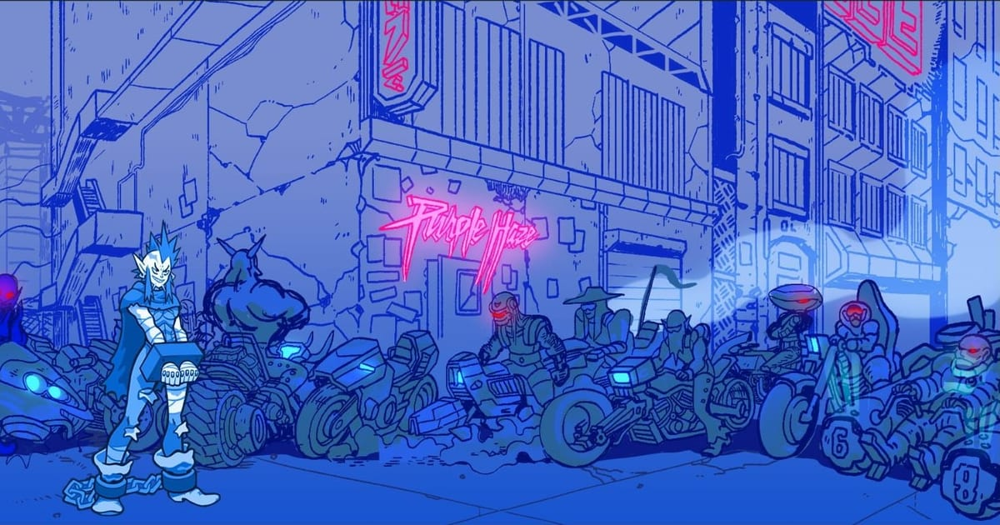

# Julián Piaggio — Portfolio de ilustración digital

Sitio web de portfolio de **Julián Piaggio**, ilustrador digital (personajes, concept art e ilustración editorial). Pensado para conseguir encargos y empleo en estudios y agencias: oscuro, minimalista, con el dibujo como protagonista, y muy rápido.

[](https://nievajuan6-svg.github.io/julian_portfolio/)

🔗 **Web:** https://nievajuan6-svg.github.io/julian_portfolio/

## Qué incluye

- **Hero** con una ilustración destacada a pantalla completa.
- **Galería masonry** con filtros por categoría (generados solos desde las carpetas) y URL compartible (`?cat=…`).
- **Visor de obra** (lightbox) con ficha completa: título, categoría, software, año y cliente. Navegación con flechas, teclado y swipe.
- **Proceso**: comparador boceto ↔ resultado final + tira con las etapas (solo imágenes).
- **Sobre mí / CV**, con un retrato difuminado de fondo detrás del título.
- **Contacto**: botones "Enviar mail" (abre el programa de correo, con enlaces a Gmail y Outlook web) y WhatsApp, redes, formulario opcional y un **rollo de fotos** que corre solo.
- SEO (Open Graph, JSON-LD, sitemap), accesibilidad (teclado, `prefers-reduced-motion`, contraste AA) y carga rápida.

## Stack

Next.js 15 (App Router, export estático) · React 19 · Tailwind CSS v4 · TypeScript · `sharp` para optimizar imágenes · GitHub Pages.

## Cómo agregar obras (sin tocar código)

Todo el contenido visual se maneja con **carpetas y nombres de archivo**:

```
contenido/
├── obras/
│   ├── personajes/     ← la carpeta es la categoría
│   ├── concept-art/
│   └── editorial/
├── hero/               ← 1 imagen para la portada
├── retrato/            ← 1 foto tuya, se ve difuminada detrás de "Sobre mí"
├── fotos/              ← fotos chicas del rollo de Contacto (se ordenan por nombre)
└── proceso/
    └── Nombre de la obra/   1_boceto.png, 2_linea.png, 3_render.png, 4_final.png
```

**Nombre de cada obra:** `Titulo__Software__Año__Cliente.png` (doble guión bajo; el cliente es opcional).

```
Retrato de Ana__Krita__2025.png
Ciudad flotante__Blender + Photoshop__2024__Estudio X.png
01_Portada revista__Illustrator__2024.png      ← el número inicial solo fija el orden
```

Después, doble clic en **`subir.bat`**: procesa las imágenes y publica la web.
El manual completo con todos los casos está en [`manual-subir-obras.html`](manual-subir-obras.html).

### Qué hace `npm run obras`

`scripts/build-obras.mjs` recorre `contenido/` y, por cada imagen: genera versiones **AVIF + WebP** en 4 tamaños (480 / 960 / 1440 / 2200 px), mide sus dimensiones reales (cero saltos de layout), crea un placeholder borroso (LQIP) y escribe `data/portfolio.generated.json`. Tiene **caché incremental** (solo reprocesa lo nuevo) y avisa en español si algún nombre de archivo está mal, sin detener el resto.

## Editar textos

Todos los textos (email, redes, "Sobre mí", experiencia, formación, disponibilidad) están en un único archivo: [`contenido/sitio.ts`](contenido/sitio.ts).
El email, el WhatsApp (`whatsapp`, con código de país y solo dígitos) y las redes también se cambian ahí.
El PDF del CV va en `public/cv/julian-piaggio-cv.pdf` (si existe, aparece el botón de descarga).

## Desarrollo local

```bash
npm install
npm run dev        # http://localhost:3000 (procesa las imágenes y arranca)
npm run build      # genera la web estática en /out
```

Requiere Node 20+.

## Deploy

Cada `git push` a `main` dispara `.github/workflows/deploy.yml`, que construye el sitio y lo publica en GitHub Pages (Settings → Pages → Source: **GitHub Actions**). Las imágenes optimizadas no se suben al repo: se regeneran en cada deploy a partir de los originales de `contenido/`.

> `contenido/retrato/retrato-ejemplo.jpg` es un avatar ficticio y las `contenido/fotos/ejemplo-*.jpg` son recortes de obras, solo para previsualizar. Reemplazalos por fotos reales. Las obras cuyo título empieza con **"Ejemplo"** también son de muestra.

© Julián Piaggio. Todos los derechos reservados.
